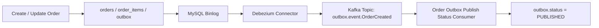

# Order Service

`Order` 모듈은 주문 생성부터 상태 변경, 이벤트 발행, 재처리까지 담당하는 핵심 도메인 서비스다.

## 구현 범위

- 주문 생성
- 주문 단건 조회
- 주문 목록 조회
- 주문 상태 변경
- 주문 취소 및 환불
- Redis 기반 멱등성 처리
- Transactional Outbox 저장
- Debezium CDC 기반 Kafka 이벤트 발행
- Outbox 상태 전환 처리
- 실패 Outbox 재처리 내부 API

## 인가 정책 (P0)
- 인증 주체는 Gateway 주입 헤더(`X-User-Id`, `X-User-Role`) 기준으로만 판단한다.
- `POST /api/v1/orders`: body `userId`와 인증 주체가 같아야 한다. (`ADMIN`은 예외)
- `GET /api/v1/orders`: 인증된 본인 주문만 조회한다.
- `GET /api/v1/admin/orders?userId=...`: `ADMIN`만 특정 사용자 주문을 조회할 수 있다.
- `GET /api/v1/orders/{orderId}`: 주문 소유자만 조회 가능하다. (`ADMIN`은 예외)
- `PATCH /api/v1/orders/{orderId}/status`: 주문 소유자만 상태 변경 가능하다. (`ADMIN`은 예외)
- 소유권 위반은 `403 FORBIDDEN` + `FORBIDDEN_RESOURCE_ACCESS`를 반환한다.
- 인증 주체 헤더 누락/비정상은 `401 UNAUTHORIZED` + `UNAUTHORIZED_PRINCIPAL`을 반환한다.

## 핵심 흐름



## 주문 상태

- `PENDING`
- `PAID`
- `FAILED`
- `CANCELLED`

허용되는 전이:

- `PENDING -> PAID`
- `PENDING -> FAILED`
- `PENDING -> CANCELLED`
- `PAID -> CANCELLED`

## 멱등성

### idempotencyKey 를 통한 멱등성 제어


#### Http-Header
- `Idempotency-Key: 1234-abcd-efgh-5678-0000`
- 멱등키는 비즈니스 데이터가 아니라 전송 제어 메타데이터
- 바디는 비즈니스 로직 데이터만 담는 게 깔끔
- HTTP 표준도 헤더에 넣는 방식을 권장

Idempotency-Key 정규화 처리
private String normalizeIdempotencyKey(String idempotencyKey) {
return idempotencyKey.trim();
}
* `@NotBlank` 검증을 통과하더라도 " Aekiori " 와 같이 값 끝에 공백이 포함된 경우에 대한
* 완전한, 안전한 valiation 은 해주지 못한다.
* DB 유니크 제약 조건 및 멱등성 비교 로직에서 예외가 발생하거나 중복 처리될 위험이 있다.

주문 생성 API는 `idempotencyKey`를 **필수** 로 받는다.

1. Redis Lock 확인
   - Lock 있음 → 409 (처리 중)


2. Redis Result 캐시 확인
   -  캐시 있음 → requestHash 비교
   - 같음 → 캐시 결과 반환
   - 다름 → 409


3. DB 조회
   - DB에 있음 → requestHash 비교
   - 같음 → 반환 + 캐시 저장
   - 다름 → 409


4. 신규 주문 생성

Redis는 아래 키를 사용한다.

- `order:idempotency:lock:{idempotencyKey}`
- `order:idempotency:result:{idempotencyKey}`

## Outbox / Kafka

이 모듈은 서비스 코드에서 직접 Kafka publish를 호출하지 않고, DB 트랜잭션 안에서 Outbox를 저장한 뒤 Debezium CDC로 이벤트를 전파한다.

주요 토픽:

- `delivery.delivery.outbox`
- `outbox.event.OrderCreated`
- `outbox.event.OrderStatusChanged`
- `outbox.event.PaymentRequested`

Outbox 상태:

- `INIT`
- `PUBLISHED`
- `FAILED`

## 내부 API

내부 운영 API는 다음 경로를 사용한다.

- `GET /api/v1/internal/outbox?status=FAILED`
- `POST /api/v1/internal/outbox/{eventId}/replay`

이 경로들은 `X-Internal-Api-Key` 헤더가 있어야 호출할 수 있다.

## 스키마 관리

스키마는 Flyway 마이그레이션으로 관리한다.

- 마이그레이션 위치: `Order/src/main/resources/db/migration`
- 기본 스크립트: `V1__init_order_schema.sql`
- JPA `ddl-auto`는 운영 설정에서 `validate`로 두고, 엔티티와 스키마 일치 여부만 확인한다.

## 로컬 실행

루트에서 전체 스택 실행:

```cmd
docker compose --env-file docker/infra/.env.infra -f docker/infra/compose.infra.yml up -d --build
docker compose --env-file docker/app/.env.app -f docker/app/compose.app.yml up -d --build
```

Debezium connector 등록:

```cmd
curl -X POST -H "Content-Type: application/json" --data-binary @Order\infra\debezium\order-outbox-connector-smt.json http://localhost:8083/connectors
```

## 테스트

```cmd
.\gradlew.bat test
```
