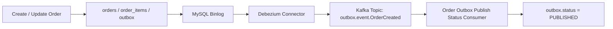

# Order Service

`Order` 모듈은 주문 생성부터 상태 변경, 이벤트 발행, 재처리까지 담당하는 핵심 도메인 서비스다.

## 구현 범위

- 주문 생성
- 주문 단건 조회
- 주문 목록 조회
- 주문 상태 변경
- 주문 상태 이력 기록
- 주문 취소 및 환불
- Redis 기반 멱등성 처리
- Transactional Outbox 저장
- Debezium CDC 기반 Kafka 이벤트 발행
- Outbox 상태 전환 처리


## 인가 정책 (P0)
- 인증 주체는 Gateway 주입 헤더(`X-User-Id`, `X-User-Role`) 기준으로만 판단한다.
- `POST /api/v1/orders`: body `userId`와 인증 주체가 같아야 한다.
- `GET /api/v1/orders`: 인증된 본인 주문만 조회한다.
- `GET /api/v1/orders/{orderId}`: 주문 소유자만 조회 가능하다.
- `PATCH /api/v1/orders/{orderId}/status`: 주문 소유자만 상태 변경 가능하다.
- 소유권 위반은 `403 FORBIDDEN` + `FORBIDDEN_RESOURCE_ACCESS`를 반환한다.
- 인증 주체 헤더 누락/비정상은 `401 UNAUTHORIZED` + `UNAUTHORIZED_PRINCIPAL`을 반환한다.

## 핵심 흐름



## 주문 상태

- `PENDING` - 주문 생성 직후
- `PAYMENT_PENDING` - 가게 검증 통과 후 결제 대기
- `PAID` - 결제 완료
- `ACCEPTED` - 사장 최종 수락
- `REFUND_PENDING` - 결제 후 사장 거절로 환불 대기
- `REFUNDED` - 환불 완료
- `FAILED` - 결제 실패
- `CANCELLED` - 취소

허용되는 전이:

- `PENDING -> PAYMENT_PENDING`
- `PENDING -> PAID`
- `PENDING -> FAILED`
- `PENDING -> CANCELLED`
- `PAYMENT_PENDING -> PAID`
- `PAYMENT_PENDING -> FAILED`
- `PAYMENT_PENDING -> CANCELLED`
- `PAID -> ACCEPTED`
- `PAID -> REFUND_PENDING`
- `PAID -> CANCELLED`
- `REFUND_PENDING -> REFUNDED`
- `REFUND_PENDING -> CANCELLED`

### 상태 이력 기록 기준

- 주문 상태 이력은 `order_status_history` 테이블에 남긴다.
- 일반적인 상태 변경은 `fromStatus -> toStatus`로 기록한다.
- 최초 주문 생성은 상태 변경이 아니라 생성이므로 `null -> PENDING`으로 기록한다.
- `INITIAL`, `NONE` 같은 센티널 상태는 쓰지 않는다.
  - Order.Status`가 실제 주문 상태만 표현해야 하고, 히스토리 전용 가짜 상태가 섞이면 도메인 의미가 흐려지기 때문이다.
  - 따러서 최초 생성 여부는 `sourceType=ORDER_CREATED`와 `fromStatus=null` 조합으로 표현한다.

## 멱등성

### idempotencyKey 를 통한 멱등성 제어
[멱동성 처리 - HTTP](../docs/idempotency-http.md)  
주문 생성 API는 `idempotencyKey`를 **필수** 로 받는다.


## Outbox / Kafka

이 모듈은 서비스 코드에서 직접 Kafka publish를 호출하지 않고, DB 트랜잭션 안에서 Outbox를 저장한 뒤 Debezium CDC로 이벤트를 전파한다.

주요 토픽:

- `outbox.event.OrderCreated`
- `outbox.event.OrderStatusChanged`
- `outbox.event.PaymentRequested`
- `outbox.event.PaymentSucceeded`
- `outbox.event.PaymentFailed`
- `outbox.event.PaymentRefunded`
- `outbox.event.StoreOrderAccepted`
- `outbox.event.StoreOrderRejected`

Outbox 상태:

- `INIT`
- `PUBLISHED`
- `FAILED`

## Swagger

- UI: `http://localhost:8081/swagger-ui.html`
- OpenAPI JSON: `http://localhost:8081/v3/api-docs`

## 스키마 관리

스키마는 Flyway 마이그레이션으로 관리한다.

- 마이그레이션 위치: `Order/src/main/resources/db/migration`
- 기본 스크립트: `V1__init_order_schema.sql`
- 상태 이력 스크립트: `V2__add_order_status_history.sql`
- JPA `ddl-auto`는 운영 설정에서 `validate`로 두고, 엔티티와 스키마 일치 여부만 확인한다.

## 로컬 실행

루트에서 전체 스택 실행:

```cmd
docker compose --env-file infra/docker/infra/.env.infra -f infra/docker/infra/compose.infra.yml up -d --build
docker compose --env-file infra/docker/app/.env.app -f infra/docker/app/compose.app.yml up -d --build
```

Debezium connector 등록:

```cmd
infra\debezium\register-all-outbox-connectors.cmd
```

- 현재 커넥터 등록은 `PUT /connectors/{name}/config` 업서트 방식으로 처리한다.
- 각 서비스 JSON에서 `name`은 URL에 쓰고, `config` 내용만 body로 보낸다.

## 테스트

```cmd
.\gradlew.bat test
```
