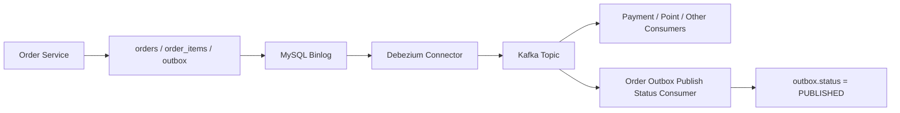

# Kafka / Debezium 운영 정리

## 1. 목적

이 문서는 `Order -> Outbox -> Debezium -> Kafka` 흐름을 로컬 개발과 운영 관점에서 정리한 문서다.

핵심 목적:

- Dual Write 문제 회피
- Outbox 기반 이벤트 발행
- SMT 적용 방향 정리
- connector 등록 / 재등록 절차 정리
- 장애 확인 순서 정리

## 2. 전체 흐름



## 3. 사용 컴포넌트

- MySQL
- Kafka
- Kafka Connect
- Debezium MySQL Connector
- Redis
- Kafka UI

관련 파일:

- [docker/infra/compose.infra.yml](../docker/infra/compose.infra.yml)
- [order-outbox-connector-smt.json](/C:/Users/wildphs/Desktop/AekioriEats/Order/infra/debezium/order-outbox-connector-smt.json)

## 4. 토픽

현재 주요 토픽:

- `delivery.delivery.outbox`
- `outbox.event.ORDER`
- `schemahistory.delivery`
- `connect-configs`
- `connect-offsets`
- `connect-status`

## 5. 인프라 방향

현재 로컬 인프라는 아래 기준으로 정리돼 있다.

- `mysql`, `redis`, `kafka`, `connect`, `kafka-ui` 모두 `restart: unless-stopped`
- `connect` healthcheck 사용
- `connect`는 `REST_ADVERTISED_HOST_NAME=connect`
- `kafka-ui`는 `kafka`, `connect` healthcheck 이후 실행

## 6. Outbox 상태 흐름

Outbox 상태:

- `INIT`
- `PUBLISHED`
- `FAILED`

처리 순서:

1. Order 서비스가 Outbox를 `INIT`으로 저장
2. Debezium이 binlog를 읽음
3. Kafka 토픽으로 이벤트 발행
4. `OutboxPublishStatusConsumer`가 메시지를 소비
5. `eventId` 기준으로 Outbox를 `PUBLISHED`로 전환

## 7. 운영 전략

### 7.1 FAILED 처리

현재 전략:

- `FAILED`는 운영 개입 대상 상태로 본다
- 실패 목록은 내부 API나 SQL로 조회한다
- 필요하면 수동 재처리 API로 다시 발행한다

### 7.2 수동 재처리

Order 서비스 내부 API:

- `GET /api/v1/internal/outbox?status=FAILED`
- `POST /api/v1/internal/outbox/{eventId}/replay`

재처리 동작:

1. 대상 Outbox를 찾는다
2. 상태가 `FAILED`인지 확인한다
3. 상태를 `INIT`으로 되돌린다
4. SMT 토픽 `outbox.event.ORDER`로 payload를 다시 발행한다
5. 이후 consumer가 `PUBLISHED`로 전환한다

## 8. Debezium 메시지 구조

### 8.1 기본 envelope 모드

기본 모드에서는 Debezium envelope를 그대로 사용한다.

주요 필드:

- `payload.before`
- `payload.after`
- `payload.source`
- `payload.op`
- `payload.ts_ms`

실제 비즈니스 payload는 보통:

- `payload.after.payload`

### 8.2 SMT 모드

SMT를 적용하면 Outbox Event Router가 토픽과 메시지를 더 단순하게 정리해준다.

현재 방향:

- 기본 토픽 `delivery.delivery.outbox`는 호환/디버깅용 유지
- SMT 토픽 `outbox.event.ORDER`를 주 소비 토픽으로 사용
- Order 서비스는 두 토픽을 모두 구독

참고:

- 현재 converter 영향으로 SMT 토픽 메시지 값에 `schema` / `payload` 래퍼가 붙을 수 있다
- Order consumer는 header / envelope / SMT wrapper를 모두 처리하도록 작성돼 있다

## 9. SMT 설정 포인트

파일:

- [order-outbox-connector-smt.json](/C:/Users/wildphs/Desktop/AekioriEats/Order/infra/debezium/order-outbox-connector-smt.json)

핵심 설정:

- `transforms=outbox`
- `io.debezium.transforms.outbox.EventRouter`
- `event_id`를 이벤트 ID로 사용
- `partition_key`를 Kafka key로 사용
- `aggregate_type` 기반 토픽 라우팅
- `event_type`, `aggregate_id`를 header로 추가

## 10. connector 확인 명령

목록:

```cmd
curl http://localhost:8083/connectors
```

상태:

```cmd
curl http://localhost:8083/connectors/order-outbox-connector/status
```

설정:

```cmd
curl http://localhost:8083/connectors/order-outbox-connector/config
```

## 11. connector 재등록

### 11.1 삭제

```cmd
curl -X DELETE http://localhost:8083/connectors/order-outbox-connector
```

### 11.2 SMT 모드 등록

```cmd
curl -X POST http://localhost:8083/connectors -H "Content-Type: application/json" --data-binary "@Order\\infra\\debezium\\order-outbox-connector-smt.json"
```

## 12. 장애 확인 순서

### 12.1 주문은 생성됐는데 Kafka 메시지가 안 보일 때

1. `outbox` row가 생성됐는지 확인
2. connector status가 `RUNNING`인지 확인
3. 토픽이 실제로 생성됐는지 확인
4. Kafka consumer로 메시지가 들어오는지 확인

### 12.2 Kafka 메시지는 있는데 Outbox가 계속 INIT일 때

의심 포인트:

- 최신 앱이 재시작되지 않음
- `OutboxPublishStatusConsumer`가 구독 중이 아님
- 토픽 메시지 구조와 consumer 파싱이 안 맞음
- connector는 살아 있지만 실제 메시지 생성이 안 됨

### 12.3 Connect 로그에 `Node disconnected`가 반복될 때

의심 포인트:

- Kafka listener / advertised listener 설정 불안정
- bootstrap은 되지만 메타데이터 연결 유지 실패
- 브로커 자체 재연결 반복

확인 순서:

1. `docker compose --env-file docker/infra/.env.infra -f docker/infra/compose.infra.yml logs connect --tail=200`
2. `curl http://localhost:8083/connectors/order-outbox-connector/status`
3.
`docker compose --env-file docker/infra/.env.infra -f docker/infra/compose.infra.yml exec kafka kafka-consumer-groups --bootstrap-server kafka:29092 --describe --group order-outbox-status`
4. 토픽 offset 확인

## 13. 운영 명령 모음

### 13.1 Kafka

```cmd
docker compose --env-file docker/infra/.env.infra -f docker/infra/compose.infra.yml exec kafka kafka-topics --bootstrap-server kafka:29092 --list
```

```cmd
docker compose --env-file docker/infra/.env.infra -f docker/infra/compose.infra.yml exec kafka kafka-console-consumer --bootstrap-server kafka:29092 --topic outbox.event.ORDER --timeout-ms 5000 --max-messages 5
```

### 13.2 Connect

```cmd
docker compose --env-file docker/infra/.env.infra -f docker/infra/compose.infra.yml logs connect --tail=200
```

```cmd
curl http://localhost:8083/connectors/order-outbox-connector/status
```

### 13.3 MySQL Outbox

```cmd
docker compose --env-file docker/infra/.env.infra -f docker/infra/compose.infra.yml exec mysql mysql -uroot -proot -D delivery -e "select id, event_id, event_type, status, created_at from outbox order by created_at desc;"
```

## 14. 정리

현재 방향은 이렇다.

- Order는 DB에 Outbox를 안전하게 저장한다
- Debezium은 그 변경을 Kafka로 옮긴다
- SMT 토픽 `outbox.event.ORDER`를 중심으로 다음 서비스가 소비한다
- Order는 다시 자기 Outbox를 소비해서 `PUBLISHED`로 상태를 정리한다

즉 이 프로젝트에서 Kafka / Debezium의 역할은 “주문 저장과 이벤트 발행을 느슨하게 연결하면서도 정합성을 잃지 않게 만드는 것”이다.
